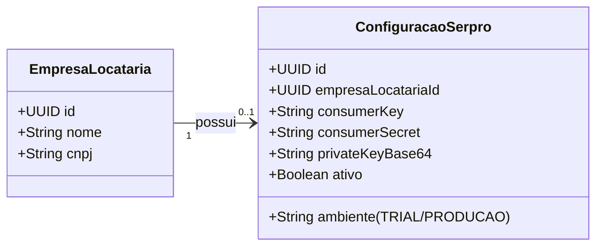

# Relatório Técnico: Escalonamento SaaS Multi-tenant para Integração SERPRO (Compartilha Receita)

> **Status**: Proposta Arquitetural (Fase de Planejamento)  
> **Objetivo**: Transicionar as credenciais SERPRO de variáveis de ambiente globais (`.env`) para um modelo dinâmico persistido por Empresa Locatária (Multi-tenant), viabilizando a escala do SaaS para múltiplos escritórios contábeis.

---

## 1. Contexto Geral e Necessidade de Negócio

No modelo atual de desenvolvimento (Fase de Validação/Diego), as chaves do SERPRO (`Consumer Key`, `Consumer Secret` e `Chave Privada RSA`) residem no arquivo `.env` global do sistema. Isso limita a aplicação a um único tenant ativo fazendo chamadas reais.

Para atuar como um **SaaS Multi-tenant**, cada escritório de contabilidade (Empresa Locatária) que assinar o sistema deve poder:
1. Contratar seu próprio plano da API no Portal SERPRO.
2. Registrar sua própria chave pública no SERPRO.
3. Cadastrar suas credenciais e carregar seu certificado digital (`.pfx`) de forma segura na interface do SaaS.
4. Realizar consultas isoladas que utilizem seu próprio faturamento e limite de chamadas contratadas da API do SERPRO.

---

## 2. Desenho de Arquitetura de Banco de Dados

Criaremos a entidade `ConfiguracaoSerpro` vinculada obrigatoriamente a uma `EmpresaLocataria` (isolamento via tenant ID).



### Script de Migração de Banco de Dados (Flyway/Liquibase)

Por conter dados extremamente sensíveis (chaves de acesso de produção e chaves privadas RSA), as colunas de credenciais serão armazenadas como texto criptografado em repouso.

```sql
CREATE TABLE serpro_configuracao (
    id UUID PRIMARY KEY,
    empresa_locataria_id UUID NOT NULL UNIQUE,
    consumer_key_criptografada TEXT NOT NULL,
    consumer_secret_criptografada TEXT NOT NULL,
    private_key_criptografada TEXT NOT NULL,
    ambiente VARCHAR(20) NOT NULL DEFAULT 'TRIAL',
    ativo BOOLEAN NOT NULL DEFAULT TRUE,
    versao BIGINT NOT NULL DEFAULT 0,
    criado_em TIMESTAMP NOT NULL DEFAULT CURRENT_TIMESTAMP,
    atualizado_em TIMESTAMP NOT NULL DEFAULT CURRENT_TIMESTAMP,
    CONSTRAINT fk_serpro_config_empresa FOREIGN KEY (empresa_locataria_id) 
        REFERENCES empresas_locatarias(id) ON DELETE CASCADE
);

CREATE INDEX idx_serpro_config_empresa ON serpro_configuracao(empresa_locataria_id);
```

---

## 3. Fluxo de Criptografia Simétrica (Segurança)

Para proteger a chave privada e credenciais no banco de dados, utilizaremos o algoritmo simétrico **AES-GCM-256** no backend.

```
[Cadastro do PFX no Frontend] 
       │
       ▼
[Backend] 
 ├── 1. Extrai Chave Privada RSA via SerproKeyExtractor (C# / Java)
 ├── 2. Lê a chave mestra global da variável de ambiente: APP_ENCRYPTION_KEY
 ├── 3. Encripta Chave Privada RSA usando AES-GCM-256
 └── 4. Salva o Ciphertext no Banco de Dados
```

---

## 4. Alterações na Estrutura de Código (Clean Architecture)

### 4.1 Camada Core (Domínio & Portas)

Criaremos a porta de repositório e o modelo no domínio.

* **Novo Domain Model:** `com.projetocontabil.core.domain.serpro.model.ConfiguracaoSerpro`
* **Nova Porta (Driven):** `com.projetocontabil.core.ports.driven.ConfiguracaoSerproRepository`

```java
package com.projetocontabil.core.ports.driven;

import com.projetocontabil.core.domain.empresalocataria.EmpresaLocatariaId;
import com.projetocontabil.core.domain.serpro.model.ConfiguracaoSerpro;
import java.util.Optional;

public interface ConfiguracaoSerproRepository {
    Optional<ConfiguracaoSerpro> buscarPorEmpresa(EmpresaLocatariaId empresaId);
    ConfiguracaoSerpro salvar(ConfiguracaoSerpro configuracao);
}
```

### 4.2 Camada de Infraestrutura (Adaptação)

O `SerproIntegration` passará a buscar dinamicamente as credenciais com base no `EmpresaLocatariaContext.getEmpresaLocatariaId()`.

```java
@Service
@RequiredArgsConstructor
public class SerproIntegration implements ConsultaRendaGateway {

    private final ConfiguracaoSerproRepository configRepo;
    private final EncryptionService encryptionService; // Serviço AES-256

    @Override
    public RendaContribuinte consultar(String tokenCompartilhamento, EmpresaLocatariaId tenantId) {
        // 1. Busca a configuração do Tenant no Banco
        ConfiguracaoSerpro config = configRepo.buscarPorEmpresa(tenantId)
            .orElseThrow(() -> new IllegalStateException("Integração SERPRO não configurada para esta empresa."));

        if (!config.isAtivo()) {
            throw new IllegalStateException("A integração SERPRO está desabilitada para esta empresa.");
        }

        // 2. Decriptografia em memória das credenciais com a chave mestra global
        String consumerKey = encryptionService.decrypt(config.getConsumerKeyCriptografada());
        String consumerSecret = encryptionService.decrypt(config.getConsumerSecretCriptografada());
        String privateKey = encryptionService.decrypt(config.getPrivateKeyCriptografada());

        // 3. Executa a chamada HTTP e decifra usando a chave privada descriptografada do tenant
        ...
    }
}
```

---

## 5. Roteiro de Implementação Futura

1. **Sprint 1: Segurança e Banco**
   - Criação da tabela de persistência `serpro_configuracao`.
   - Implementação do `EncryptionService` utilitário para cifra simétrica AES-GCM-256.
   - Criação dos testes unitários e de integração de segurança.

2. **Sprint 2: Configuração e UI Administrativa**
   - Criação do endpoint `POST /api/serpro/configuracao` para salvar as chaves e processar upload do PFX.
   - Construção do componente de frontend **"Configuração da Integração SERPRO"** no painel administrativo do escritório contábil.
   - Validação da chave privada carregada na API.

3. **Sprint 3: Handshake Dinâmico e Testes Multi-tenant**
   - Migração da lógica do `SerproIntegration` de `SerproProperties` (.env) para a busca dinâmica via banco de dados.
   - Execução de testes E2E com Playwright para simular dois Tenants distintos consultando o SERPRO com credenciais independentes.
